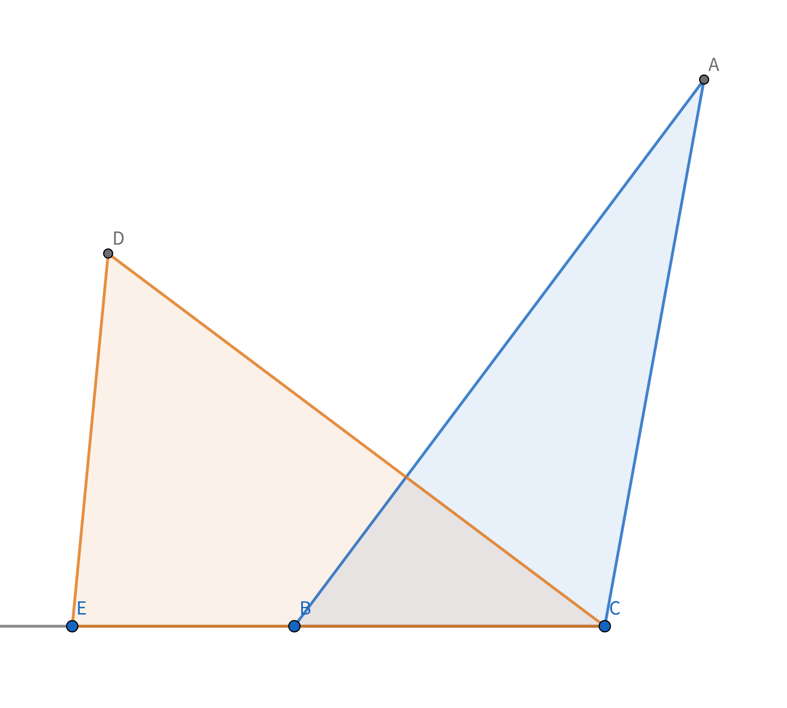
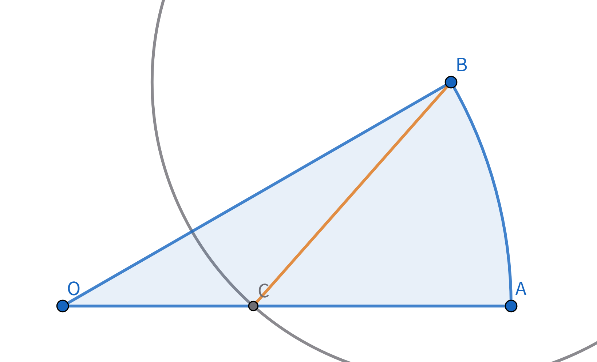
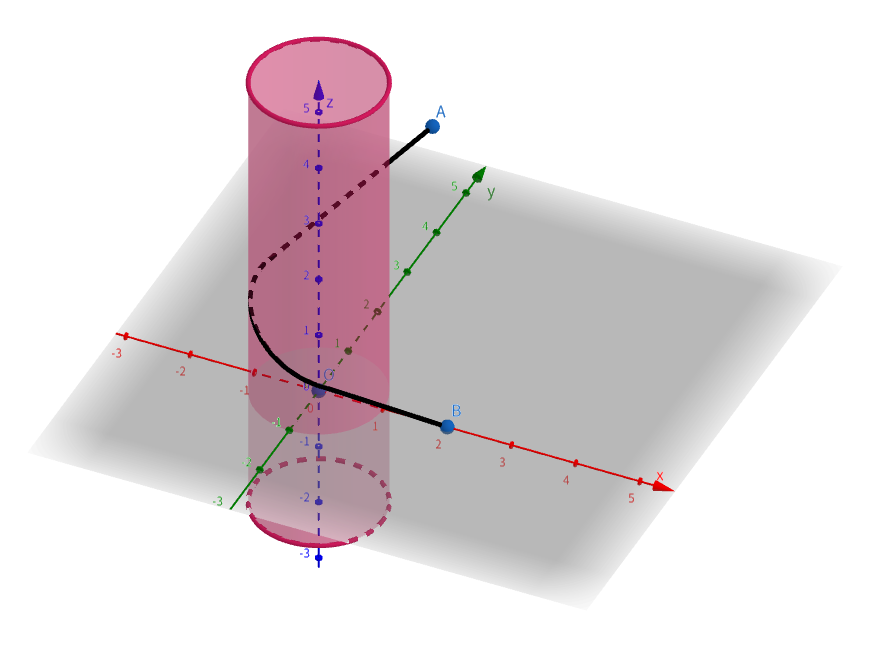
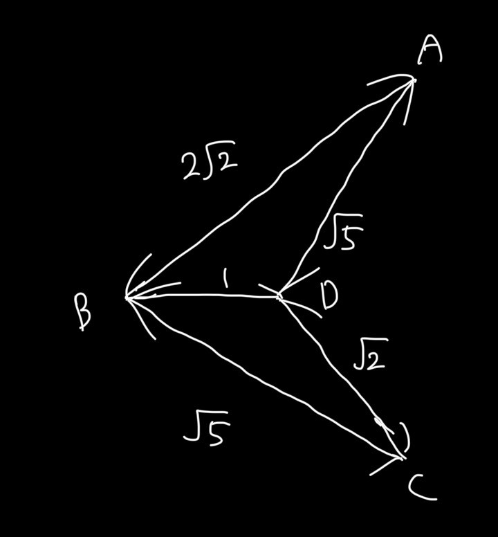

<head>
<title>数研新入生向け問題2026 PDF版</title>
</head>

# 数研新入生向け問題2026 PDF版

## 数研とは?
週に一回活動し、数学の問題を解いたり作ったりしています。また、11月に行われる数学オリンピックに向けた対策を行います。お気軽に体験に来てください！
下に部員作の問題を載せますので、ぜひ解いてみてください。仮入部にて解説します。

## 問題
「\*」がついている問題は難しいです。

1. 長さ1,2,3,4,5,6の棒が1本ずつある。これらから3つを同時に選ぶとき、3本の棒で三角形を作ることができる確率を求めよ。

1. 不等式 $ \dfrac{a^2+b^2+c^2}{3} \geqq {\left(\dfrac{a+b+c}{3}\right)}^{2} $ を示せ。ただし、$a,b,c$ は実数である。

1. $\triangle\mathrm{ABC}$ は $\mathrm{AB}=11,\mathrm{BC}=5,\mathrm{CA}=4\sqrt{5}$ を満たす。点 $\mathrm{D}$ を $\mathrm{CD}=10$ を満たし、かつ線分 $\mathrm{CD}$ と線分 $\mathrm{AB}$ が直交するようにとる。いま、半直線 $\mathrm{CB}$ 上に点 $\mathrm{E}$ をとると、$\triangle\mathrm{ABC}$ の面積と $\triangle\mathrm{CDE}$ の面積が等しくなった。このとき、線分 $\mathrm{BE}$ の長さを求めよ。
    

1. 円周率が $3.05$ より大きく $3.3$ より小さいことを示せ。

1. \* $2026$ 個の島があり、$N$ 本のフェリーの航路をつくる。それぞれの航路は異なる2つの島を結び、それを使うことで2つの島を行き来することができる。また、どの2つの島の組に対しても、それらを結ぶ航路が2つ以上存在することはなく、フェリーを使わずに島どうしを移動することはできない。このとき、どのような航路であっても次の条件が成り立つような $N$ の最小値を求めよ。 
&nbsp; __条件__ : どの2つの島の組に対しても、1回以上フェリーに乗ることで行き来することができる。

1. 点 $\mathrm{O}$ を中心とする半径3の円の周上に、弧 $\mathrm{AB}$ の長さが $\dfrac{\pi}{2}$ となるように2点 $\mathrm{A,B}$ をとる。点 $\mathrm{B}$ を中心とする半径2の円をかき、線分 $\mathrm{OA}$ との交点を $\mathrm{C}$ とする。弧 $\mathrm{AB}$ ,線分 $\mathrm{BC}$ ,線分 $\mathrm{CA}$ に囲まれた図形の面積を求めよ。
    

1. \* $n$ は2で最大 $f(n)$ 回割り切れるとする。$f(2000!)+f(2001!)+f(2002!)+\cdots\cdots+f(2031!)$ を計算せよ。

1. \* $xyz$ 空間内に3点 $\mathrm{O}(0,0,0),\mathrm{A}(0,\sqrt{6}+\sqrt{2},2),\mathrm{B}(2,0,0)$ がある。点 $\mathrm{A,B}$ を太さのないひもで以下の条件を満たすように結ぶとき、このひもの長さとして考えられる最小値を求めよ。 
&nbsp; __条件__ : ひもは領域 $x^2+y^2\lt 1$ ( $z$ は任意) および $y=x(x\geqq 0)$ ( $z$ は任意) を通らない。
    

1. 方程式 $3n^2+2n+11-3m^2=0$ ($n,m$は正の整数)を解け。

 

## Ex1
2026年のある日付を正の整数 $a,b,c$ を使って  $a$ / $(10b+c)$ と表す。このとき、$100a+10b+c=b^c-a$ となる $a,b,c$ の値の組をすべて求めよ。

## Ex2
平面上に4点 $\mathrm{A,B,C,D}$ があり、$ \mathrm{AB}=2\sqrt{2}, \mathrm{AD}=\sqrt{5}, \mathrm{BC}=\sqrt{5}, \mathrm{BD}=1, \mathrm{CD}=\sqrt{2}$ を満たしている。このとき, 凹四角形 $\mathrm{ABCD}$ の面積を求めよ。

